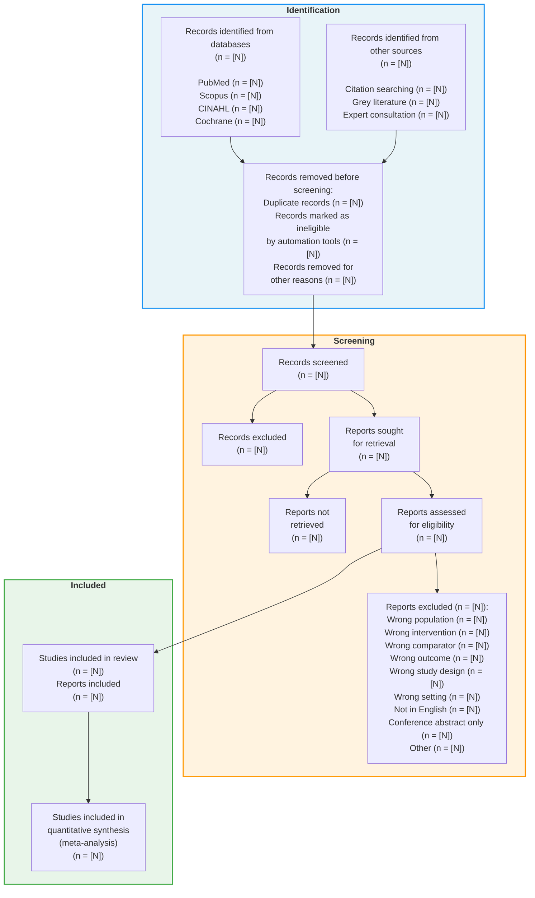
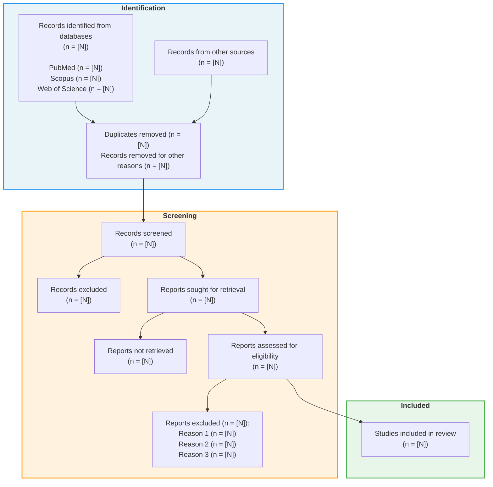
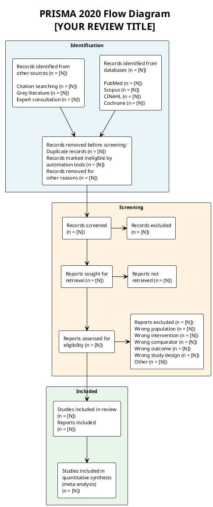
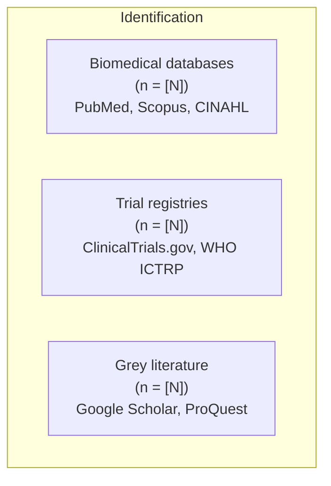

# PRISMA 2020 Flow Diagram Templates

## Overview

The PRISMA 2020 flow diagram documents the flow of information through different phases of a systematic review: identification, screening, and inclusion. This file provides copy-paste ready templates in three formats.

Reference: Page MJ, McKenzie JE, Bossuyt PM, et al. The PRISMA 2020 statement: an updated guideline for reporting systematic reviews. BMJ. 2021;372:n71.

---

## 1. Mermaid.js Version (Recommended)

Copy this code into any Mermaid-compatible renderer (GitHub, Notion, Obsidian, Mermaid Live Editor at https://mermaid.live).



### Simplified Version (No Meta-Analysis)

If your systematic review does not include a meta-analysis, use this version:



---

## 2. PlantUML Version

Save as `.puml` file or paste into PlantUML renderer (https://www.plantuml.com/plantuml/uml).



---

## 3. ASCII Art Version (Plain Text)

For use in plain text documents, emails, or protocols where graphical rendering is unavailable.

```
=============================================================================
                      PRISMA 2020 FLOW DIAGRAM
                      [YOUR REVIEW TITLE]
=============================================================================

 IDENTIFICATION
+----------------------------------------------+
|                                              |
|  Records identified from     Records from    |
|  databases (n = [N])         other sources   |
|                              (n = [N])       |
|    PubMed      (n = [N])                     |
|    Scopus      (n = [N])     Citation        |
|    CINAHL      (n = [N])     searching       |
|    Cochrane    (n = [N])     (n = [N])       |
|                              Grey lit         |
|                              (n = [N])       |
+----------------------------------------------+
                      |
                      v
+----------------------------------------------+
|  Records removed before screening:           |
|    Duplicate records removed  (n = [N])      |
|    Ineligible by automation   (n = [N])      |
|    Other reasons              (n = [N])      |
+----------------------------------------------+
                      |
                      v
 SCREENING
+----------------------------------------------+
|  Records screened  ------>  Records excluded |
|  (n = [N])                  (n = [N])        |
+----------------------------------------------+
                      |
                      v
+----------------------------------------------+
|  Reports sought    ------>  Reports not      |
|  for retrieval              retrieved         |
|  (n = [N])                  (n = [N])        |
+----------------------------------------------+
                      |
                      v
+----------------------------------------------+
|  Reports assessed  ------>  Reports excluded |
|  for eligibility            (n = [N]):       |
|  (n = [N])                                   |
|                       Wrong population  [N]  |
|                       Wrong intervention[N]  |
|                       Wrong comparator  [N]  |
|                       Wrong outcome     [N]  |
|                       Wrong design      [N]  |
|                       Not in English    [N]  |
|                       Other             [N]  |
+----------------------------------------------+
                      |
                      v
 INCLUDED
+----------------------------------------------+
|  Studies included in review (n = [N])        |
|  Reports included           (n = [N])        |
+----------------------------------------------+
                      |
                      v
+----------------------------------------------+
|  Studies included in quantitative synthesis  |
|  (meta-analysis) (n = [N])                   |
+----------------------------------------------+
```

---

## 4. Customization Instructions

### Step-by-Step

1. **Replace `[N]` placeholders** with your actual numbers
2. **Replace `[YOUR REVIEW TITLE]`** with your systematic review title
3. **Adjust database names** in the Identification box to match your actual search
4. **Customize exclusion reasons** in the eligibility assessment box to match your criteria
5. **Remove the meta-analysis box** if your review is qualitative only
6. **Add or remove "other sources"** categories as needed

### Common Modifications

#### No Other Sources (Databases Only)

Remove the `other1` box and merge all records into the database path.

#### Multiple Database Paths

If you searched very different types of databases (e.g., clinical databases vs. trial registries), you can split the Identification section:



#### Scoping Review (No Critical Appraisal Box)

Scoping reviews typically do not include quality assessment. Simply remove any quality/risk-of-bias boxes.

#### Updated Systematic Review

If updating a previous review, add a box for "Studies included in previous version (n = [N])" feeding into the Included section.

### Exclusion Reason Categories

Choose from these common exclusion categories (customize to your review):

| Category | Description |
|----------|-------------|
| Wrong population | Does not meet population criteria |
| Wrong intervention/exposure | Intervention does not match |
| Wrong comparator | No appropriate comparison group |
| Wrong outcome | Primary outcome not measured |
| Wrong study design | Not the target study design (e.g., not RCT) |
| Wrong setting | Study conducted in excluded setting |
| Language | Not in included language(s) |
| Duplicate | Same study reported elsewhere |
| Full text unavailable | Could not obtain full text after attempts |
| Conference abstract only | No full peer-reviewed publication |
| Protocol/registry only | Only a study protocol, no results |
| Not original research | Editorial, letter, commentary |

### Number Verification Checklist

Before finalizing your PRISMA diagram, verify:

- [ ] Total identified = sum of all database records + other sources
- [ ] Records after deduplication = Total identified - duplicates removed
- [ ] Records screened = Records after deduplication
- [ ] Records excluded (title/abstract) + reports sought = records screened
- [ ] Reports not retrieved + reports assessed = reports sought
- [ ] Reports excluded (full text) + studies included = reports assessed
- [ ] Sum of exclusion reasons = total reports excluded at full text
- [ ] Studies in meta-analysis <= studies included in review

---

## 5. Tools for Rendering

| Tool | Format | URL |
|------|--------|-----|
| Mermaid Live Editor | Mermaid | https://mermaid.live |
| PlantUML Server | PlantUML | https://www.plantuml.com/plantuml/uml |
| GitHub | Mermaid (native) | Any .md file in a repo |
| Obsidian | Mermaid (native) | Use mermaid code block |
| draw.io / diagrams.net | Manual | https://app.diagrams.net |
| PRISMA Flow Diagram Generator | Web form | http://www.prisma-statement.org/PRISMAStatement/FlowDiagram |
| Lucidchart | Manual | https://lucid.app |

### Export Tips

- **For journals**: Export as SVG or high-resolution PNG (300+ DPI)
- **Mermaid Live Editor**: Click "Actions" > "PNG" or "SVG"
- **PlantUML**: Append `/svg/` or `/png/` to the URL
- **Most journals accept**: TIFF, EPS, PDF, or high-res PNG
- **Typical figure size**: Width 170mm (full page) or 85mm (single column)
